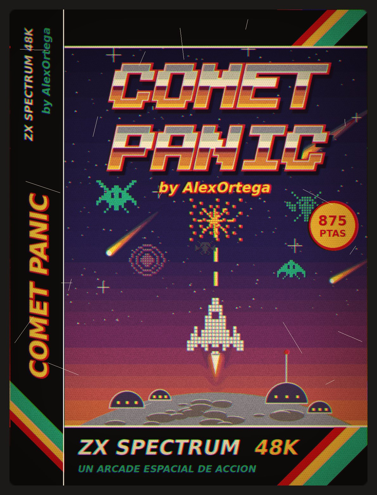
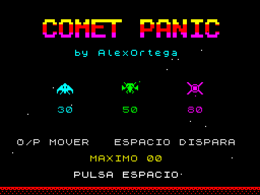
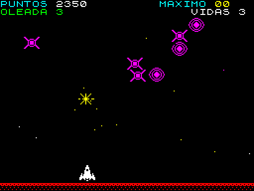
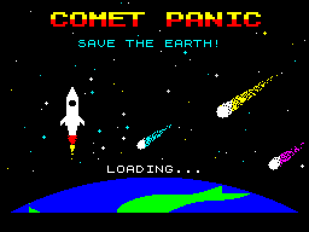

# Comet Panic

<p align="center">
  
</p>

<p align="center">
  
  
</p>

<p align="center">
  <a href="#english">English</a> · <a href="#català">Català</a> · <a href="#castellano">Castellano</a>
</p>

---

## English

**Comet Panic** is a shoot 'em up for the **ZX Spectrum 48K**. It is written in [Boriel ZX Basic](https://zxbasic.readthedocs.io/), a BASIC dialect that compiles to machine code, with the time-critical routines (sprites, stars and sound) in Z80 assembler.

Created by **AlexOrtega**.

### How to play

You are the last ship defending the lunar station. Enemy ships fly in from the sides of the screen, gather into a **flock** that sways and flutters at the top, and from there they **dive** at you while dropping bombs. If a diving enemy misses you, it leaves through the bottom, reappears at the top and rejoins the flock.

#### Controls

| Key     | Action                                   |
|---------|------------------------------------------|
| `O`     | Move left                                |
| `P`     | Move right                               |
| `SPACE` | Fire (hold it down for continuous fire)  |

You can move and fire at the same time, with up to two of your shots on screen.

#### Rules

- You start with **3 lives**. You lose one if a bomb hits you or an enemy crashes into your ship.
- Each **wave** has 16 enemies, with at most 8 on screen at once. Destroy them all to reach the next wave.
- Waves cycle through three enemy types. Every three waves, all of them fly faster, attack more often and drop more bombs.

| Enemy       | Colour  | Behaviour                     | Points | While diving |
|-------------|---------|-------------------------------|--------|--------------|
| *Cold Eye*  | Cyan    | Smooth flight, the easiest    | 30     | 60           |
| *Super Fly* | Green   | Very fast and jittery         | 50     | 100          |
| *Atomic*    | Magenta | Fast, deep dives              | 80     | 160          |

- Clearing a wave gives a **bonus of 100 × the wave number**.
- The **high score** is kept between games until you switch off or reset the Spectrum.

### Play right away (no compiling needed)

The repository includes the ready-made tape, [comet_panic.tap](comet_panic.tap). All you need is a ZX Spectrum emulator.

**ZEsarUX.** From the folder of the [ZEsarUX](https://github.com/chernandezba/zesarux) executable, giving the path to the TAP:

```bash
./zesarux --tape path/to/comet_panic/comet_panic.tap
```

- Without extra options, the tape loads at real speed: you will see the **border stripes** and the **loading screen** appearing little by little, just like on a real Spectrum.
- Add `--fastautoload` if you prefer instant loading.
- You can also open the file from the ZEsarUX menu with **Smart load**.

**Other emulators.** `comet_panic.tap` is a standard tape and works in any 48K Spectrum emulator (Fuse, Spectaculator, JSSpeccy, Retro Virtual Machine...). Opening the file is usually enough. If it doesn't start by itself, type `LOAD ""` (key `J`, then `Symbol Shift + P` twice) and press `Enter`.

**What you will see while loading:**

1. A small BASIC loader that turns the screen black.
2. The Comet Panic **loading screen**, drawn line by line with the border stripes.
3. The game, which starts by itself on the **title screen**. Press `SPACE` to play.

<p align="center">
  
</p>

### Building the game

You only need this if you change the code, the sprites or the loading screen. These instructions are for Linux or WSL (Ubuntu on Windows).

**1. Requirements**

- **Python 3.9 or newer** (tested with Python 3.12).
- **Boriel ZX Basic** (the `zxbc` compiler), installed with `pip`. Tested with version 1.18.7.

**2. Install the compiler**

The recommended way is a virtual environment inside the repository, in `.venv/`. The build script finds the compiler there automatically, and `.venv/` is excluded from git.

```bash
cd path/to/comet_panic
python3 -m venv .venv
.venv/bin/pip install zxbasic
```

On Ubuntu, if `python3 -m venv` complains about `ensurepip`, install virtual environment support first:

```bash
sudo apt install python3-venv
```

If you can't use `sudo`, create the environment without `pip` and install it by hand:

```bash
python3 -m venv --without-pip .venv
curl -sL https://bootstrap.pypa.io/get-pip.py -o /tmp/get-pip.py
.venv/bin/python /tmp/get-pip.py
.venv/bin/pip install zxbasic
```

The script looks for the compiler in this order:

1. The `ZXBC` environment variable (for example `ZXBC=/path/to/zxbc python3 build_comet_panic_tap.py`).
2. A `zxbc` on the `PATH`.
3. `.venv/bin/zxbc` inside the repository.

**3. Build the tape**

From the root of the repository:

```bash
python3 build_comet_panic_tap.py
```

If everything goes well you will see `Created comet_panic.tap (... bytes)`. The script:

1. Converts the ASCII-art sprites and the title logo into Spectrum data and writes them to `build/sprites.bas`.
2. Compiles [comet_panic.bas](comet_panic.bas) with `zxbc` into `build/comet_panic.bin` (machine code).
3. Assembles [comet_panic.tap](comet_panic.tap) with the BASIC loader, the loading screen and the game.

The `build/` folder is temporary: it is regenerated on every build and excluded from git.

**4. (Optional) Regenerate the loading screen**

The loading screen is drawn in code by [make_loading_screen.py](make_loading_screen.py), which only uses the Python standard library:

```bash
python3 make_loading_screen.py
python3 build_comet_panic_tap.py
```

The first command writes `assets/comet_panic_loading.scr` (Spectrum format) and `assets/comet_panic_loading.png` (a preview). The second rebuilds the tape with the new screen.

### Project structure

| File                                                                 | Description                                                  |
|----------------------------------------------------------------------|--------------------------------------------------------------|
| [comet_panic.bas](comet_panic.bas)                                   | Game source code (Boriel ZX Basic + Z80 assembler).          |
| [build_comet_panic_tap.py](build_comet_panic_tap.py)                 | Sprites (ASCII art), title logo, compiling and TAP assembly. |
| [make_loading_screen.py](make_loading_screen.py)                     | Draws the loading screen and writes the `.scr` and `.png`.   |
| [comet_panic.tap](comet_panic.tap)                                   | Tape ready to load in an emulator.                           |
| [assets/comet_panic_cover.jpeg](assets/comet_panic_cover.jpeg)       | Cassette inlay cover.                                        |
| [assets/comet_panic_loading.scr](assets/comet_panic_loading.scr)     | Loading screen (6912 bytes, native Spectrum format).         |
| [assets/comet_panic_loading.png](assets/comet_panic_loading.png)     | Loading screen preview.                                      |
| [assets/comet_panic_title.png](assets/comet_panic_title.png)         | Title screen capture.                                        |
| [assets/comet_panic_gameplay.png](assets/comet_panic_gameplay.png)   | Gameplay capture.                                            |
| `build/` *(generated)*                                               | Intermediate build files.                                    |
| `.venv/` *(optional)*                                                | Virtual environment with the `zxbc` compiler.                |

### How it works

**The tape.** [comet_panic.tap](comet_panic.tap) contains three files, in this order:

| Block        | Type             | Contents                                                                  |
|--------------|------------------|---------------------------------------------------------------------------|
| `COMETPANIC` | BASIC program    | Auto-running loader: `CLEAR 32767`, `LOAD "" SCREEN$`, `LOAD "" CODE`, `RANDOMIZE USR 32768`. |
| `SCREEN`     | Bytes (6912)     | Loading screen, loaded straight into video memory (`16384`).              |
| `CP-GAME`    | Bytes (~19 KB)   | The compiled game, loaded at `32768` and started with `RANDOMIZE USR`.    |

The border stripes are drawn by the Spectrum ROM's own loading routine. The loader does `POKE 23624,0` so the tape messages (`Bytes: ...`) are printed black on black and don't spoil the loading screen.

**Memory map.**

| Address          | Use                                                                         |
|------------------|-----------------------------------------------------------------------------|
| `16384–23295`    | Screen (pixels and colour attributes).                                      |
| `23296–23304`    | Parameters for the assembler routines (in the unused printer buffer).       |
| `< 32768`        | Machine stack (below `CLEAR 32767`).                                        |
| `32768–~52000`   | Compiled game code, sprites, logo and motion tables.                        |
| `61440–61831`    | Game tables: objects on screen, stars, enemies, shots, bombs and sprite addresses. |

The build script checks that the code never grows into the tables at `61440`.

**Graphics.**

- **16×16 pixel sprites** that move pixel by pixel. They are drawn with **XOR**: drawing a sprite twice in the same place erases it, so the background never has to be saved.
- Every sprite is stored **pre-shifted** in its 8 possible pixel positions (8 × 16 rows × 3 bytes), so the drawing routine only copies bytes and never shifts bits during the game.
- Colour is applied by painting the **attributes** of the 8×8 cells each sprite covers. The background is black, so the typical Spectrum *colour clash* is barely noticeable.
- One-pixel **stars** falling at different speeds, also drawn with XOR.
- Two-frame animations: enemy wings, the ship's engine flame and explosions.

**Speed.**

- The game syncs with the screen interrupt and runs at a **steady 25 frames per second** (it updates every 2 interrupts of 1/50 s).
- Drawing, stars and sound are in **Z80 assembler**.
- Enemy, shot, bomb and star state lives in **fixed memory tables** read and written with `PEEK`/`POKE`, which in Boriel ZX Basic is much faster than using arrays.

**Enemy behaviour.** Each enemy has a position and velocity in 1/16-pixel units and follows simple physics: every frame it accelerates towards a target, up to a top speed.

- **In the flock**, the target is its slot in the formation. The formation sways from side to side and each enemy also traces a small orbit, so they are never still.
- **When diving**, the target is your ship. They first hop upwards and then swoop down, speeding up and correcting their course, which produces smooth swooping curves.

### Customising the game

**Sprites.** The sprites live in the `SPRITES` dictionary in [build_comet_panic_tap.py](build_comet_panic_tap.py). They are 16-column drawings (`#` = pixel on, `.` = off) with up to 16 rows:

```python
"SHIP": [
    ".......##.......",
    ".......##.......",
    "......####......",
    ...
],
```

Edit the `#` and run `python3 build_comet_panic_tap.py` again. Each name creates an `SPR_<NAME>` constant used by the game code. If you add sprites, add them at the end so the existing ones keep their numbers.

**Difficulty.** In [comet_panic.bas](comet_panic.bas):

| What                                  | Where                                                        |
|---------------------------------------|--------------------------------------------------------------|
| Acceleration of each enemy type       | `accT` (Cold Eye, Super Fly, Atomic)                         |
| Top speed in the flock                | `vmT`                                                        |
| Top speed when diving                 | `vdT`                                                        |
| Points per type (in tens)             | `ptsT`                                                       |
| Colour per type                       | `colT` (64 + ink; e.g. 69 = bright cyan)                     |
| Enemies per wave                      | `pending = 16` in `startWave`                                |
| Attack and bomb frequency             | `attch` and `bombch` in `startWave`                          |
| Starting lives                        | `lives = 3` in `playGame`                                    |
| Ship speed                            | `px - 4` / `px + 4` in `updatePlayer`                        |
| Fire rate                             | `firecool = 4` in `updatePlayer`                             |

**Loading screen.** Edit the drawing in [make_loading_screen.py](make_loading_screen.py) and run `python3 make_loading_screen.py`, or replace `assets/comet_panic_loading.scr` with your own screen (for example a 256×192 PNG converted with `png2scr`). Then run `python3 build_comet_panic_tap.py` again.

### Troubleshooting

| Problem | Solution |
|---------|----------|
| `zxbc not found` | The compiler isn't installed or the script can't find it. Follow *Install the compiler* above or give its path with `ZXBC=/path/to/zxbc`. |
| `python3 -m venv` fails with `ensurepip is not available` | Install `python3-venv` (`sudo apt install python3-venv`) or use the `--without-pip` alternative above. |
| `Game code (...) overlaps the data tables` | The code has grown too much. Move the tables (`OBJT`, `STARS`, `ENEM`... in [comet_panic.bas](comet_panic.bas) and `TABLES_ADDRESS` in [build_comet_panic_tap.py](build_comet_panic_tap.py)) to a higher address, below `65368`. |
| Compile error in `comet_panic.bas` | `zxbc` shows the line with the error. Remember it is Boriel ZX Basic, not Sinclair BASIC: for example, you leave a `SUB` with `RETURN`, and each array needs its own `DIM`. |
| The tape doesn't start by itself | Type `LOAD ""` and press `Enter`. Make sure the emulator is in **48K** mode. |
| The keys don't respond | Use `O`, `P` and `SPACE`. If the emulator maps a joystick onto those keys, turn it off. |

### Credits

- **Author:** AlexOrtega.
- Compiled with [Boriel ZX Basic](https://github.com/boriel-basic/zxbasic). Reference emulator: [ZEsarUX](https://github.com/chernandezba/zesarux).

---

## Català

**Comet Panic** és un matamarcians per a **ZX Spectrum 48K**. Està escrit en [Boriel ZX Basic](https://zxbasic.readthedocs.io/), un BASIC que es compila a codi màquina, amb les rutines crítiques (sprites, estrelles i so) en assemblador Z80.

Creat per **AlexOrtega**.

### Com es juga

Ets l'última nau que defensa l'estació lunar. Les naus enemigues entren volant pels costats de la pantalla, s'agrupen en una **bandada** que es balanceja i voleteja a dalt de tot, i des d'allà es llancen **en picat** contra tu deixant anar bombes. Si un enemic en picat no t'encerta, surt per baix, torna a aparèixer a dalt i es reincorpora a la bandada.

#### Controls

| Tecla   | Acció                                          |
|---------|------------------------------------------------|
| `O`     | Moure a l'esquerra                             |
| `P`     | Moure a la dreta                               |
| `ESPAI` | Disparar (mantén-la premuda per a tir continu) |

Et pots moure i disparar alhora, amb fins a dos trets teus a la pantalla.

#### Regles

- Comences amb **3 vides**. En perds una si t'encerta una bomba o si un enemic xoca contra la teva nau.
- Cada **onada** té 16 enemics, amb un màxim de 8 a la pantalla alhora. Destrueix-los tots per passar a la següent.
- Les onades alternen tres tipus d'enemic. Cada tres onades, tots volen més ràpid, ataquen més sovint i llancen més bombes.

| Enemic      | Color   | Comportament                    | Punts | En picat |
|-------------|---------|---------------------------------|-------|----------|
| *Cold Eye*  | Cian    | Vol suau, el més fàcil          | 30    | 60       |
| *Super Fly* | Verd    | Molt ràpid i nerviós            | 50    | 100      |
| *Atomic*    | Magenta | Ràpid, picats profunds          | 80    | 160      |

- En completar una onada reps un **bonus de 100 × el número d'onada**.
- La **puntuació màxima** es manté entre partides mentre no apaguis o reiniciïs l'Spectrum.

### Jugar ara mateix (sense compilar res)

El repositori inclou la cinta ja generada, [comet_panic.tap](comet_panic.tap). Només necessites un emulador de ZX Spectrum.

**ZEsarUX.** Des de la carpeta de l'executable de [ZEsarUX](https://github.com/chernandezba/zesarux), indicant la ruta al TAP:

```bash
./zesarux --tape ruta/a/comet_panic/comet_panic.tap
```

- Sense més opcions, la cinta es carrega a velocitat real: veuràs les **ratlles de la vora** i la **pantalla de càrrega** apareixent a poc a poc, com en un Spectrum de debò.
- Si prefereixes que carregui a l'instant, afegeix `--fastautoload`.
- També pots obrir el fitxer des del menú de ZEsarUX amb **Smart load**.

**Altres emuladors.** `comet_panic.tap` és una cinta estàndard i funciona en qualsevol emulador d'Spectrum 48K (Fuse, Spectaculator, JSSpeccy, Retro Virtual Machine...). Normalment n'hi ha prou d'obrir el fitxer. Si no arrenca sol, escriu `LOAD ""` (tecla `J`, després `Symbol Shift + P` dues vegades) i prem `Enter`.

**Què veuràs en carregar:**

1. Un petit carregador BASIC que posa la pantalla en negre.
2. La **pantalla de càrrega** de Comet Panic, que es va dibuixant amb les ratlles de la vora.
3. El joc, que arrenca sol a la **pantalla de títol**. Prem `ESPAI` per començar.

### Compilar el joc

Només cal si modifiques el codi, els sprites o la pantalla de càrrega. Aquestes instruccions són per a Linux o WSL (Ubuntu a Windows).

**1. Requisits**

- **Python 3.9 o superior** (provat amb Python 3.12).
- **Boriel ZX Basic** (el compilador `zxbc`), que s'instal·la amb `pip`. Provat amb la versió 1.18.7.

**2. Instal·lar el compilador**

La manera recomanada és crear un entorn virtual dins del mateix repositori, a la carpeta `.venv/`. L'script de compilació hi busca el compilador automàticament, i `.venv/` està exclosa de git.

```bash
cd ruta/a/comet_panic
python3 -m venv .venv
.venv/bin/pip install zxbasic
```

A Ubuntu, si `python3 -m venv` dona un error sobre `ensurepip`, instal·la abans el suport d'entorns virtuals:

```bash
sudo apt install python3-venv
```

Si no pots fer servir `sudo`, crea l'entorn sense `pip` i instal·la'l a mà:

```bash
python3 -m venv --without-pip .venv
curl -sL https://bootstrap.pypa.io/get-pip.py -o /tmp/get-pip.py
.venv/bin/python /tmp/get-pip.py
.venv/bin/pip install zxbasic
```

L'script busca el compilador en aquest ordre:

1. La variable d'entorn `ZXBC` (per exemple `ZXBC=/ruta/a/zxbc python3 build_comet_panic_tap.py`).
2. Un `zxbc` que sigui al `PATH`.
3. `.venv/bin/zxbc` dins del repositori.

**3. Generar la cinta**

Des de l'arrel del repositori:

```bash
python3 build_comet_panic_tap.py
```

Si tot va bé veuràs `Created comet_panic.tap (... bytes)`. L'script:

1. Converteix els sprites en art ASCII i el logotip del títol en dades per a l'Spectrum i els escriu a `build/sprites.bas`.
2. Compila [comet_panic.bas](comet_panic.bas) amb `zxbc` i obté `build/comet_panic.bin` (codi màquina).
3. Munta [comet_panic.tap](comet_panic.tap) amb el carregador BASIC, la pantalla de càrrega i el joc.

La carpeta `build/` és temporal: es regenera a cada compilació i està exclosa de git.

**4. (Opcional) Regenerar la pantalla de càrrega**

La pantalla de càrrega es dibuixa amb codi a [make_loading_screen.py](make_loading_screen.py), que només fa servir la biblioteca estàndard de Python:

```bash
python3 make_loading_screen.py
python3 build_comet_panic_tap.py
```

La primera ordre genera `assets/comet_panic_loading.scr` (format de l'Spectrum) i `assets/comet_panic_loading.png` (una vista prèvia). La segona torna a muntar la cinta amb la nova pantalla.

### Estructura del projecte

| Fitxer                                                               | Descripció                                                     |
|----------------------------------------------------------------------|----------------------------------------------------------------|
| [comet_panic.bas](comet_panic.bas)                                   | Codi font del joc (Boriel ZX Basic + assemblador Z80).         |
| [build_comet_panic_tap.py](build_comet_panic_tap.py)                 | Sprites (art ASCII), logotip, compilació i muntatge del TAP.   |
| [make_loading_screen.py](make_loading_screen.py)                     | Dibuixa la pantalla de càrrega i genera el `.scr` i el `.png`. |
| [comet_panic.tap](comet_panic.tap)                                   | Cinta a punt per carregar en un emulador.                      |
| [assets/comet_panic_cover.jpeg](assets/comet_panic_cover.jpeg)       | Caràtula de cassette.                                          |
| [assets/comet_panic_loading.scr](assets/comet_panic_loading.scr)     | Pantalla de càrrega (6912 bytes, format natiu de l'Spectrum).  |
| [assets/comet_panic_loading.png](assets/comet_panic_loading.png)     | Vista prèvia de la pantalla de càrrega.                        |
| [assets/comet_panic_title.png](assets/comet_panic_title.png)         | Captura de la pantalla de títol.                               |
| [assets/comet_panic_gameplay.png](assets/comet_panic_gameplay.png)   | Captura d'una partida.                                         |
| `build/` *(generada)*                                                | Fitxers intermedis de la compilació.                           |
| `.venv/` *(opcional)*                                                | Entorn virtual amb el compilador `zxbc`.                       |

### Com funciona per dins

**La cinta.** [comet_panic.tap](comet_panic.tap) conté tres fitxers, en aquest ordre:

| Bloc         | Tipus            | Contingut                                                                 |
|--------------|------------------|---------------------------------------------------------------------------|
| `COMETPANIC` | Programa BASIC   | Carregador amb arrencada automàtica: `CLEAR 32767`, `LOAD "" SCREEN$`, `LOAD "" CODE`, `RANDOMIZE USR 32768`. |
| `SCREEN`     | Bytes (6912)     | Pantalla de càrrega, carregada directament a la memòria de vídeo (`16384`). |
| `CP-GAME`    | Bytes (~19 KB)   | El joc compilat, carregat a `32768` i executat amb `RANDOMIZE USR`.       |

Les ratlles de la vora les dibuixa la mateixa rutina de càrrega de la ROM de l'Spectrum. El carregador fa `POKE 23624,0` perquè els missatges de la cinta (`Bytes: ...`) surtin en negre sobre negre i no espatllin la pantalla de càrrega.

**Mapa de memòria.**

| Adreça           | Ús                                                                            |
|------------------|-------------------------------------------------------------------------------|
| `16384–23295`    | Pantalla (píxels i atributs de color).                                        |
| `23296–23304`    | Paràmetres de les rutines en assemblador (al búfer d'impressora, que no es fa servir). |
| `< 32768`        | Pila de la màquina (per sota de `CLEAR 32767`).                               |
| `32768–~52000`   | Codi del joc compilat, sprites, logotip i taules de moviment.                 |
| `61440–61831`    | Taules del joc: objectes a la pantalla, estrelles, enemics, trets, bombes i adreces dels sprites. |

L'script de compilació comprova que el codi no creixi tant que trepitgi les taules de `61440`.

**Gràfics.**

- **Sprites de 16×16 píxels** que es mouen píxel a píxel. Es dibuixen amb **XOR**: dibuixar un sprite dues vegades al mateix lloc l'esborra, així que no cal desar el fons.
- Cada sprite es desa **pre-desplaçat** en les seves 8 posicions de píxel possibles (8 × 16 files × 3 bytes). Així la rutina de dibuix només copia bytes, sense desplaçar bits durant el joc.
- El color s'aplica pintant els **atributs** de les cel·les de 8×8 que ocupa cada sprite. El fons és negre, així que el típic *colour clash* de l'Spectrum gairebé no es nota.
- **Estrelles** d'un píxel que baixen a velocitats diferents, dibuixades també amb XOR.
- Animacions de dos fotogrames: ales dels enemics, flama del motor de la nau i explosions.

**Velocitat.**

- El joc se sincronitza amb la interrupció de pantalla i funciona a **25 fotogrames per segon constants** (s'actualitza cada 2 interrupcions de 1/50 s).
- Les rutines de dibuix, estrelles i so són en **assemblador Z80**.
- L'estat d'enemics, trets, bombes i estrelles viu en **taules de memòria fixa** que es llegeixen i s'escriuen amb `PEEK`/`POKE`. En Boriel ZX Basic això és molt més ràpid que fer servir arrays.

**Comportament dels enemics.** Cada enemic té posició i velocitat en unitats de 1/16 de píxel i es mou amb una física senzilla: a cada fotograma accelera cap a un objectiu, amb una velocitat màxima.

- **A la bandada**, l'objectiu és el seu lloc a la formació. La formació es balanceja d'un costat a l'altre i cada enemic descriu a més una petita òrbita, així que mai no estan quiets.
- **En picat**, l'objectiu és la teva nau. Primer fan un petit salt cap amunt i després baixen accelerant i corregint la direcció, cosa que produeix corbes suaus i envolvents.

### Personalitzar el joc

**Sprites.** Els sprites són al diccionari `SPRITES` de [build_comet_panic_tap.py](build_comet_panic_tap.py). Són dibuixos de 16 columnes (`#` = píxel encès, `.` = apagat) i fins a 16 files:

```python
"SHIP": [
    ".......##.......",
    ".......##.......",
    "......####......",
    ...
],
```

Edita els `#` i torna a executar `python3 build_comet_panic_tap.py`. Cada nom genera una constant `SPR_<NOM>` que fa servir el codi del joc. Si afegeixes sprites, fes-ho al final perquè els existents mantinguin la numeració.

**Dificultat.** A [comet_panic.bas](comet_panic.bas):

| Què                                     | On                                                           |
|-----------------------------------------|--------------------------------------------------------------|
| Acceleració de cada tipus d'enemic      | `accT` (Cold Eye, Super Fly, Atomic)                         |
| Velocitat màxima a la bandada           | `vmT`                                                        |
| Velocitat màxima en picat               | `vdT`                                                        |
| Punts de cada tipus (en desenes)        | `ptsT`                                                       |
| Color de cada tipus                     | `colT` (64 + tinta; per exemple 69 = cian brillant)          |
| Enemics per onada                       | `pending = 16` a `startWave`                                 |
| Freqüència d'atacs i de bombes          | `attch` i `bombch` a `startWave`                             |
| Vides inicials                          | `lives = 3` a `playGame`                                     |
| Velocitat de la nau                     | `px - 4` / `px + 4` a `updatePlayer`                         |
| Cadència de tir                         | `firecool = 4` a `updatePlayer`                              |

**Pantalla de càrrega.** Edita el dibuix a [make_loading_screen.py](make_loading_screen.py) i executa `python3 make_loading_screen.py`, o substitueix `assets/comet_panic_loading.scr` per la teva pròpia pantalla (per exemple, un PNG de 256×192 convertit amb `png2scr`). Després torna a executar `python3 build_comet_panic_tap.py`.

### Solució de problemes

| Problema | Solució |
|----------|---------|
| `zxbc not found` | El compilador no està instal·lat o l'script no el troba. Segueix el pas *Instal·lar el compilador* o indica'n la ruta amb `ZXBC=/ruta/a/zxbc`. |
| `python3 -m venv` falla amb `ensurepip is not available` | Instal·la `python3-venv` (`sudo apt install python3-venv`) o fes servir l'alternativa amb `--without-pip` descrita més amunt. |
| `Game code (...) overlaps the data tables` | El codi ha crescut massa. Mou les taules (`OBJT`, `STARS`, `ENEM`... a [comet_panic.bas](comet_panic.bas) i `TABLES_ADDRESS` a [build_comet_panic_tap.py](build_comet_panic_tap.py)) a una adreça més alta, per sota de `65368`. |
| Error de compilació a `comet_panic.bas` | `zxbc` mostra la línia de l'error. Recorda que és Boriel ZX Basic i no Sinclair BASIC: per exemple, se surt d'un `SUB` amb `RETURN` i cada array es declara amb el seu propi `DIM`. |
| La cinta no arrenca sola | Escriu `LOAD ""` i prem `Enter`. Assegura't que l'emulador està en mode **48K**. |
| Les tecles no responen | Fes servir `O`, `P` i `ESPAI`. Si l'emulador té un joystick configurat sobre aquestes tecles, desactiva'l. |

### Crèdits

- **Autor:** AlexOrtega.
- Compilat amb [Boriel ZX Basic](https://github.com/boriel-basic/zxbasic). Emulador de referència: [ZEsarUX](https://github.com/chernandezba/zesarux).

---

## Castellano

**Comet Panic** es un matamarcianos para **ZX Spectrum 48K**. Está escrito en [Boriel ZX Basic](https://zxbasic.readthedocs.io/), un BASIC que se compila a código máquina, con las rutinas críticas (sprites, estrellas y sonido) en ensamblador Z80.

Creado por **AlexOrtega**.

### Cómo se juega

Eres la última nave que defiende la estación lunar. Las naves enemigas entran volando por los lados de la pantalla, se agrupan en una **bandada** que se balancea y revolotea en lo alto, y desde ahí se lanzan **en picado** contra ti soltando bombas. Si un enemigo en picado no te alcanza, sale por abajo, reaparece arriba y vuelve a la bandada.

#### Controles

| Tecla     | Acción                                            |
|-----------|---------------------------------------------------|
| `O`       | Mover a la izquierda                              |
| `P`       | Mover a la derecha                                |
| `ESPACIO` | Disparar (mantén pulsado para disparo continuo)   |

Puedes moverte y disparar a la vez, con hasta dos disparos tuyos en pantalla.

#### Reglas

- Empiezas con **3 vidas**. Pierdes una si te alcanza una bomba o si un enemigo choca contra tu nave.
- Cada **oleada** tiene 16 enemigos, con un máximo de 8 en pantalla a la vez. Destrúyelos todos para pasar a la siguiente.
- Las oleadas alternan tres tipos de enemigo. Cada tres oleadas, todos vuelan más rápido, atacan más a menudo y lanzan más bombas.

| Enemigo       | Color    | Comportamiento                         | Puntos | En picado |
|---------------|----------|----------------------------------------|--------|-----------|
| *Cold Eye*    | Cian     | Vuelo suave, el más fácil              | 30     | 60        |
| *Super Fly*   | Verde    | Muy rápido y nervioso                  | 50     | 100       |
| *Atomic*      | Magenta  | Rápido, picados profundos              | 80     | 160       |

- Al completar una oleada recibes un **bonus de 100 × el número de oleada**.
- La **puntuación máxima** se mantiene entre partidas mientras no apagues o reinicies el Spectrum.

### Jugar ya (sin compilar nada)

El repositorio incluye la cinta ya generada, [comet_panic.tap](comet_panic.tap). Solo necesitas un emulador de ZX Spectrum.

**ZEsarUX.** Desde la carpeta del ejecutable de [ZEsarUX](https://github.com/chernandezba/zesarux), indicando la ruta al TAP:

```bash
./zesarux --tape ruta/a/comet_panic/comet_panic.tap
```

- Sin más opciones, la cinta se carga a velocidad real: verás las **rayas del borde** y la **pantalla de carga** apareciendo poco a poco, como en un Spectrum de verdad.
- Si prefieres que cargue al instante, añade `--fastautoload`.
- También puedes abrir el archivo desde el menú de ZEsarUX con **Smart load**.

**Otros emuladores.** `comet_panic.tap` es una cinta estándar y funciona en cualquier emulador de Spectrum 48K (Fuse, Spectaculator, JSSpeccy, Retro Virtual Machine...). Normalmente basta con abrir el archivo. Si no arranca solo, escribe `LOAD ""` (tecla `J`, después `Symbol Shift + P` dos veces) y pulsa `Enter`.

**Qué verás al cargar:**

1. Un pequeño cargador BASIC que pone la pantalla en negro.
2. La **pantalla de carga** de Comet Panic, que se va dibujando con las rayas del borde.
3. El juego, que arranca solo en la **pantalla de título**. Pulsa `ESPACIO` para empezar.

### Compilar el juego

Solo hace falta si modificas el código, los sprites o la pantalla de carga. Estas instrucciones son para Linux o WSL (Ubuntu en Windows).

**1. Requisitos**

- **Python 3.9 o superior** (probado con Python 3.12).
- **Boriel ZX Basic** (el compilador `zxbc`), que se instala con `pip`. Probado con la versión 1.18.7.

**2. Instalar el compilador**

La forma recomendada es crear un entorno virtual dentro del propio repositorio, en la carpeta `.venv/`. El script de compilación busca ahí el compilador automáticamente, y `.venv/` está excluida de git.

```bash
cd ruta/a/comet_panic
python3 -m venv .venv
.venv/bin/pip install zxbasic
```

En Ubuntu, si `python3 -m venv` da un error sobre `ensurepip`, instala antes el soporte de entornos virtuales:

```bash
sudo apt install python3-venv
```

Si no puedes usar `sudo`, crea el entorno sin `pip` e instálalo a mano:

```bash
python3 -m venv --without-pip .venv
curl -sL https://bootstrap.pypa.io/get-pip.py -o /tmp/get-pip.py
.venv/bin/python /tmp/get-pip.py
.venv/bin/pip install zxbasic
```

El script busca el compilador en este orden:

1. La variable de entorno `ZXBC` (por ejemplo `ZXBC=/ruta/a/zxbc python3 build_comet_panic_tap.py`).
2. Un `zxbc` que esté en el `PATH`.
3. `.venv/bin/zxbc` dentro del repositorio.

**3. Generar la cinta**

Desde la raíz del repositorio:

```bash
python3 build_comet_panic_tap.py
```

Si todo va bien verás `Created comet_panic.tap (... bytes)`. El script:

1. Convierte los sprites en arte ASCII y el logotipo del título en datos para el Spectrum y los escribe en `build/sprites.bas`.
2. Compila [comet_panic.bas](comet_panic.bas) con `zxbc` y obtiene `build/comet_panic.bin` (código máquina).
3. Monta [comet_panic.tap](comet_panic.tap) con el cargador BASIC, la pantalla de carga y el juego.

La carpeta `build/` es temporal: se regenera en cada compilación y está excluida de git.

**4. (Opcional) Regenerar la pantalla de carga**

La pantalla de carga se dibuja por código en [make_loading_screen.py](make_loading_screen.py), que solo usa la biblioteca estándar de Python:

```bash
python3 make_loading_screen.py
python3 build_comet_panic_tap.py
```

El primer comando genera `assets/comet_panic_loading.scr` (formato del Spectrum) y `assets/comet_panic_loading.png` (una vista previa). El segundo vuelve a montar la cinta con la nueva pantalla.

### Estructura del proyecto

| Archivo                                                              | Descripción                                                     |
|----------------------------------------------------------------------|-----------------------------------------------------------------|
| [comet_panic.bas](comet_panic.bas)                                   | Código fuente del juego (Boriel ZX Basic + ensamblador Z80).    |
| [build_comet_panic_tap.py](build_comet_panic_tap.py)                 | Sprites (arte ASCII), logotipo, compilación y montaje del TAP.  |
| [make_loading_screen.py](make_loading_screen.py)                     | Dibuja la pantalla de carga y genera el `.scr` y el `.png`.     |
| [comet_panic.tap](comet_panic.tap)                                   | Cinta lista para cargar en un emulador.                         |
| [assets/comet_panic_cover.jpeg](assets/comet_panic_cover.jpeg)       | Carátula de cassette.                                           |
| [assets/comet_panic_loading.scr](assets/comet_panic_loading.scr)     | Pantalla de carga (6912 bytes, formato nativo del Spectrum).    |
| [assets/comet_panic_loading.png](assets/comet_panic_loading.png)     | Vista previa de la pantalla de carga.                           |
| [assets/comet_panic_title.png](assets/comet_panic_title.png)         | Captura de la pantalla de título.                               |
| [assets/comet_panic_gameplay.png](assets/comet_panic_gameplay.png)   | Captura de una partida.                                         |
| `build/` *(generada)*                                                | Archivos intermedios de la compilación.                         |
| `.venv/` *(opcional)*                                                | Entorno virtual con el compilador `zxbc`.                       |

### Cómo funciona por dentro

**La cinta.** [comet_panic.tap](comet_panic.tap) contiene tres archivos, en este orden:

| Bloque       | Tipo              | Contenido                                                                 |
|--------------|-------------------|---------------------------------------------------------------------------|
| `COMETPANIC` | Programa BASIC    | Cargador con autoarranque: `CLEAR 32767`, `LOAD "" SCREEN$`, `LOAD "" CODE`, `RANDOMIZE USR 32768`. |
| `SCREEN`     | Bytes (6912)      | Pantalla de carga, cargada directamente en la memoria de vídeo (`16384`). |
| `CP-GAME`    | Bytes (~19 KB)    | El juego compilado, cargado en `32768` y ejecutado con `RANDOMIZE USR`.   |

Las rayas del borde las dibuja la propia rutina de carga de la ROM del Spectrum. El cargador hace `POKE 23624,0` para que los mensajes de la cinta (`Bytes: ...`) salgan en negro sobre negro y no estropeen la pantalla de carga.

**Mapa de memoria.**

| Dirección        | Uso                                                                                |
|------------------|------------------------------------------------------------------------------------|
| `16384–23295`    | Pantalla (píxeles y atributos de color).                                           |
| `23296–23304`    | Parámetros de las rutinas en ensamblador (en el búfer de impresora, que no se usa). |
| `< 32768`        | Pila de la máquina (por debajo de `CLEAR 32767`).                                  |
| `32768–~52000`   | Código del juego compilado, sprites, logotipo y tablas de movimiento.              |
| `61440–61831`    | Tablas del juego: objetos en pantalla, estrellas, enemigos, disparos, bombas y direcciones de sprites. |

El script de compilación comprueba que el código no crezca tanto como para pisar las tablas de `61440`.

**Gráficos.**

- **Sprites de 16×16 píxeles** que se mueven píxel a píxel. Se dibujan con **XOR**: dibujar un sprite dos veces en el mismo sitio lo borra, así que no hace falta guardar el fondo.
- Cada sprite se guarda **pre-desplazado** en sus 8 posiciones de píxel posibles (8 × 16 filas × 3 bytes). Así la rutina de dibujo solo copia bytes, sin desplazar bits en tiempo de juego.
- El color se aplica pintando los **atributos** de las celdas de 8×8 que ocupa cada sprite. El fondo es negro, así que el típico *colour clash* del Spectrum apenas se nota.
- **Estrellas** de un píxel que bajan a distintas velocidades, dibujadas también con XOR.
- Animaciones de dos fotogramas: alas de los enemigos, llama del motor de la nave y explosiones.

**Velocidad.**

- El juego se sincroniza con la interrupción de pantalla y funciona a **25 fotogramas por segundo constantes** (se actualiza cada 2 interrupciones de 1/50 s).
- Las rutinas de dibujo, estrellas y sonido están en **ensamblador Z80**.
- El estado de enemigos, disparos, bombas y estrellas vive en **tablas de memoria fija** que se leen y escriben con `PEEK`/`POKE`. En Boriel ZX Basic esto es mucho más rápido que usar arrays.

**Comportamiento de los enemigos.** Cada enemigo tiene posición y velocidad en unidades de 1/16 de píxel y se mueve con una física sencilla: en cada fotograma acelera hacia un objetivo, con una velocidad máxima.

- **En la bandada**, el objetivo es su hueco en la formación. La formación se balancea de lado a lado y cada enemigo describe además una pequeña órbita, así que nunca están quietos.
- **En picado**, el objetivo es tu nave. Primero dan un pequeño salto hacia arriba y luego bajan acelerando y corrigiendo la dirección, lo que produce curvas suaves y envolventes.

### Personalizar el juego

**Sprites.** Los sprites están en el diccionario `SPRITES` de [build_comet_panic_tap.py](build_comet_panic_tap.py). Son dibujos de 16 columnas (`#` = píxel encendido, `.` = apagado) y hasta 16 filas:

```python
"SHIP": [
    ".......##.......",
    ".......##.......",
    "......####......",
    ...
],
```

Edita los `#` y vuelve a ejecutar `python3 build_comet_panic_tap.py`. Cada nombre genera una constante `SPR_<NOMBRE>` que usa el código del juego. Si añades sprites, hazlo al final para no cambiar la numeración de los existentes.

**Dificultad.** En [comet_panic.bas](comet_panic.bas):

| Qué                                     | Dónde                                                            |
|-----------------------------------------|------------------------------------------------------------------|
| Aceleración de cada tipo de enemigo     | `accT` (Cold Eye, Super Fly, Atomic)                             |
| Velocidad máxima en la bandada          | `vmT`                                                            |
| Velocidad máxima en picado              | `vdT`                                                            |
| Puntos de cada tipo (en decenas)        | `ptsT`                                                           |
| Color de cada tipo                      | `colT` (64 + tinta; por ejemplo 69 = cian brillante)             |
| Enemigos por oleada                     | `pending = 16` en `startWave`                                    |
| Frecuencia de ataques y de bombas       | `attch` y `bombch` en `startWave`                                |
| Vidas iniciales                         | `lives = 3` en `playGame`                                        |
| Velocidad de la nave                    | `px - 4` / `px + 4` en `updatePlayer`                            |
| Cadencia de disparo                     | `firecool = 4` en `updatePlayer`                                 |

**Pantalla de carga.** Edita el dibujo en [make_loading_screen.py](make_loading_screen.py) y ejecuta `python3 make_loading_screen.py`, o sustituye `assets/comet_panic_loading.scr` por tu propia pantalla (por ejemplo, un PNG de 256×192 convertido con `png2scr`). Después, vuelve a ejecutar `python3 build_comet_panic_tap.py`.

### Solución de problemas

| Problema | Solución |
|----------|----------|
| `zxbc not found` | El compilador no está instalado o el script no lo encuentra. Sigue el paso *Instalar el compilador* o indica la ruta con `ZXBC=/ruta/a/zxbc`. |
| `python3 -m venv` falla con `ensurepip is not available` | Instala `python3-venv` (`sudo apt install python3-venv`) o usa la alternativa con `--without-pip` descrita arriba. |
| `Game code (...) overlaps the data tables` | El código ha crecido demasiado. Mueve las tablas (`OBJT`, `STARS`, `ENEM`... en [comet_panic.bas](comet_panic.bas) y `TABLES_ADDRESS` en [build_comet_panic_tap.py](build_comet_panic_tap.py)) a una dirección más alta, por debajo de `65368`. |
| Error de compilación en `comet_panic.bas` | `zxbc` muestra la línea del error. Recuerda que es Boriel ZX Basic y no Sinclair BASIC: por ejemplo, se sale de un `SUB` con `RETURN` y cada array se declara en su propio `DIM`. |
| La cinta no arranca sola | Escribe `LOAD ""` y pulsa `Enter`. Asegúrate de que el emulador está en modo **48K**. |
| Las teclas no responden | Usa `O`, `P` y `ESPACIO`. Si el emulador tiene un joystick configurado sobre esas teclas, desactívalo. |

### Créditos

- **Autor:** AlexOrtega.
- Compilado con [Boriel ZX Basic](https://github.com/boriel-basic/zxbasic). Emulador de referencia: [ZEsarUX](https://github.com/chernandezba/zesarux).
